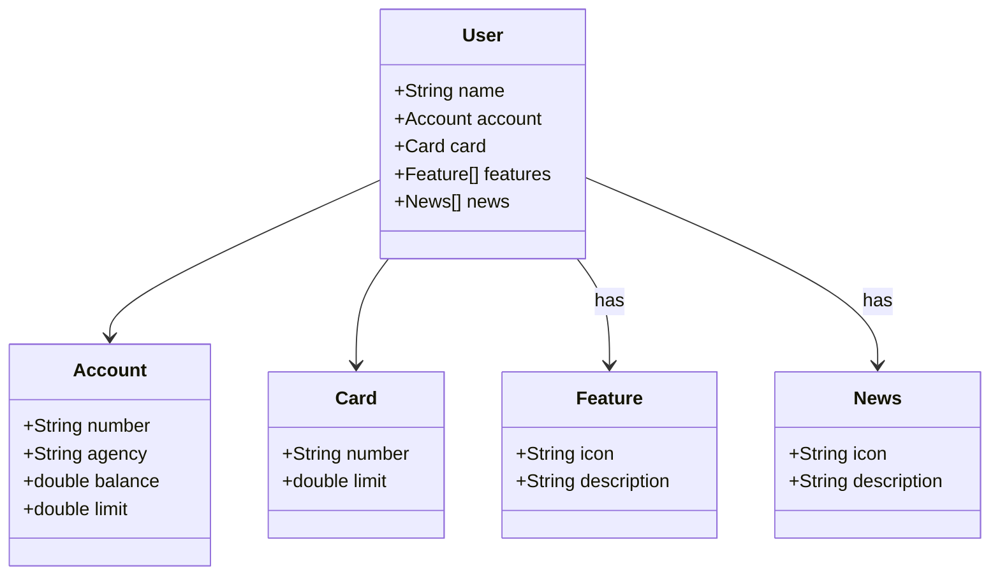

# Diagrama de Classes do Usuário

```mermaid
classDiagram
    class User {
        +String name
        +Account account
        +Card card
        +Feature[] features
        +News[] news
    }

    class Account {
        +String number
        +String agency
        +double balance
        +double limit
    }

    class Card {
        +String number
        +double limit
    }

    class Feature {
        +String icon
        +String description
    }

    class News {
        +String icon
        +String description
    }

    User --> Account
    User --> Card
    User --> Feature : has
    User --> News : has
```
